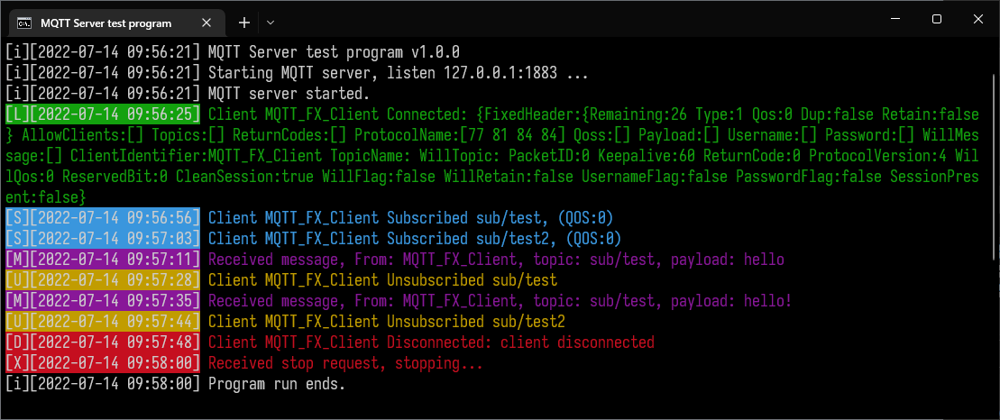
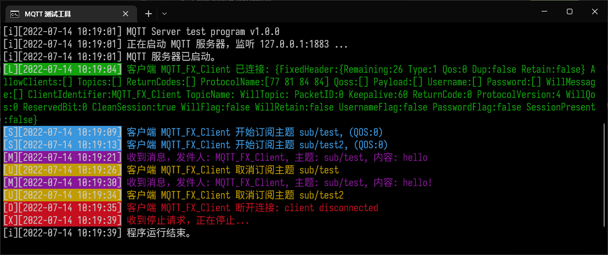

# MQTT client test tool

This tool can help you test the stability of your device's MQTT connection. [Github](https://github.com/tongdysoft/mqtt-test-server)

- version: `1.2.0`
- golang version (main): `1.20.4`
- golang version (release): `1.18.2`

## Install

Download the program from Release. No installation required.

## Usage

Command: mqtt-test-server `< -l .. | -p .. | -c .. | -t .. | -w .. | -m .. | -s .. | -o .. >`

- `-l string`
  - Language ( `en(default) | cn` )
- `-p string`
  - Define listening on IP:Port (default: `127.0.0.1:1883` )
  - To allow all IP addresses: `:1883`
- `-ca string`
  - CA certificate file path
- `-ce string`
  - Server certificate file path
- `-ck string`
  - Server key file path
- `-cp string`
  - Server key file password
- `-c string`
  - Only allow these client IDs ( `,` separated)
- `-t string`
  - Only allow these topics ( `,` separated)
- `-w string`
  - Only allow these words in message content ( `,` separated)
- `-m path-string`
  - Log message to csv file
- `-s path-string`
  - Log state changes to a csv file
- `-o path-string`
  - Save log to txt/log file
- `-n`
  - Use a monochrome color scheme
- `-v`
  - Print version info

## Build

```
go get .     # Need internet
go generate  # Windows only
go build .
```

Build all platforms under Windows: `build.bat`

## Screenshot



## LICENSE

Copyright (c) 2022 KagurazakaYashi@Tongdy MqttClientTestTool is licensed under Mulan PSL v2. You can use this software according to the terms and conditions of the Mulan PSL v2. You may obtain a copy of Mulan PSL v2 at: <http://license.coscl.org.cn/MulanPSL2> THIS SOFTWARE IS PROVIDED ON AN “AS IS” BASIS, WITHOUT WARRANTIES OF ANY KIND, EITHER EXPRESS OR IMPLIED, INCLUDING BUT NOT LIMITED TO NON-INFRINGEMENT, MERCHANTABILITY OR FIT FOR A PARTICULAR PURPOSE. See the Mulan PSL v2 for more details.

## Third-party

- logrusorgru/aurora ([The Unlicense](https://github.com/logrusorgru/aurora/blob/master/LICENSE))
- mochi-co/mqtt ([MIT License](https://github.com/mochi-co/mqtt/blob/master/LICENSE.md))
- akavel/rsrc ([MIT License](https://github.com/akavel/rsrc/blob/master/LICENSE.txt))
- gorilla/websocket ([BSD 2-Clause "Simplified" License](https://github.com/gorilla/websocket/blob/master/LICENSE))
- josephspurrier/goversioninfo ([MIT License](https://github.com/josephspurrier/goversioninfo/blob/master/LICENSE))
- rs/xid ([MIT License](https://github.com/rs/xid/blob/master/LICENSE))


# MQTT 客户端测试工具

这个工具可以帮助您测试设备的 MQTT 连接的稳定性。

- 版本: `1.2.0`
- golang 版本 (主线): `1.20.4`
- golang 版本 (最新编译): `1.18.2`

## 安装

从 Release 下载相应系统的可执行文件即可，无需安装。

## 使用说明

命令行参数: mqtt-test-server `< -l .. | -p .. | -c .. | -t .. | -w .. | -m .. | -s .. | -o .. >`

- `-l 字符串`
  - 语言 ( `en(英语,默认) | cn(简体中文)` )
- `-p 字符串`
  - 指定要监听的地址和端口 (默认值: `127.0.0.1:1883` )
  - 如需允许所有 IP 地址： `:1883`
- `-ca 文件路径字符串`
  - CA 证书文件路径
- `-ce 文件路径字符串`
  - 服务器证书文件路径
- `-ck 文件路径字符串`
  - 服务器私钥文件路径
- `-cp 字符串`
  - 服务器私钥文件的密码
- `-c 字符串`
  - 只允许客户端 ID 为这些的客户端（使用 `,` 分隔）
- `-t 字符串`
  - 只接收这些主题的信息（使用 `,` 分隔）
- `-w 字符串`
  - 只有消息内容包含这些关键词才会处理（使用 `,` 分隔）
- `-d 文件路径字符串`
  - 将收取到的消息保存到某个 .csv 文件
- `-s 文件路径字符串`
  - 将客户端的连接、断开、订阅、退订等行为保存到某个 .csv 文件
- `-o 文件路径字符串`
  - 将日志输出保存到某个 .txt / .log 文件
- `-n`
  - 使用单色模式输出，避免某些不支持彩色的终端输出乱码
- `-v`
  - 显示版本号等信息并退出

可以将 `中文交互模式.bat` 和 exe 放在一起，双击启动交互模式，无需关心命令行参数书写。

## 编译

```
go get .     # 需要有互联网连接
go generate  # 只有 Windows 需要执行这条
go build .
```

在 Windows 环境下编译所有平台版本: `build.bat`

## 截图



## 许可

Copyright (c) 2022 神楽坂雅詩@Tongdy MQTT 客户端测试工具。
您对“软件”的复制、使用、修改及分发受木兰宽松许可证，第2版的条款的约束。
